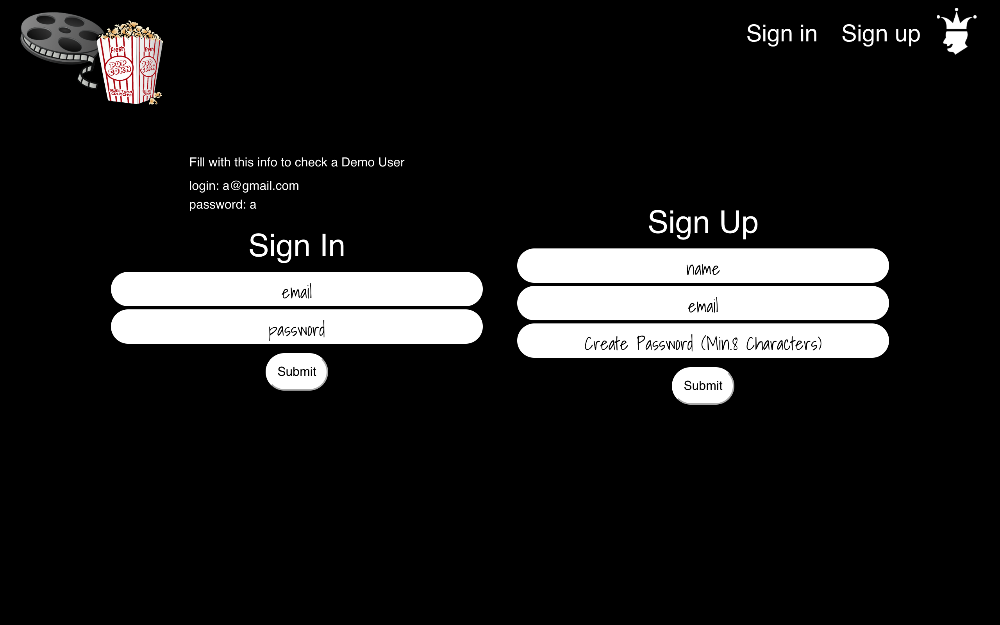
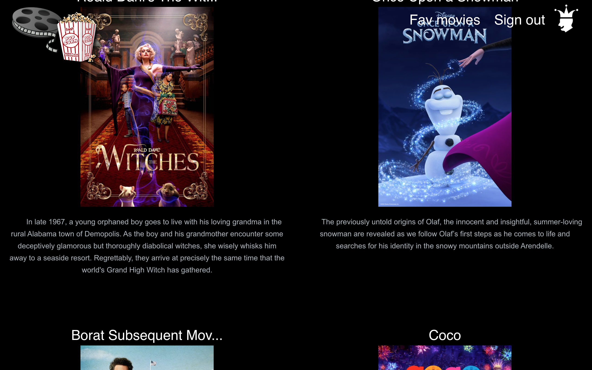
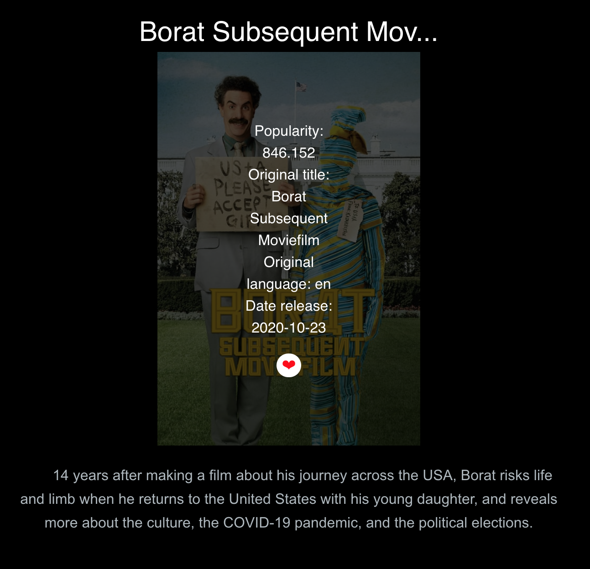
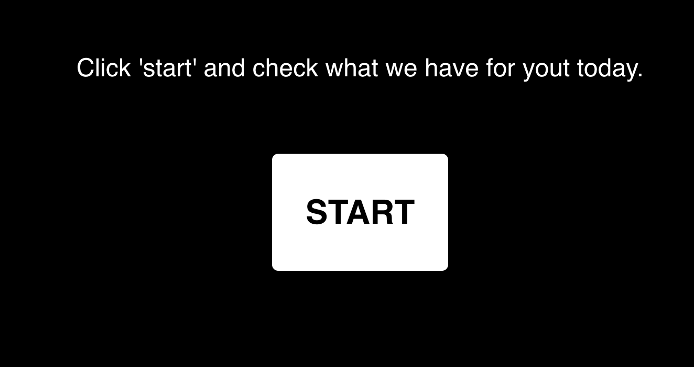
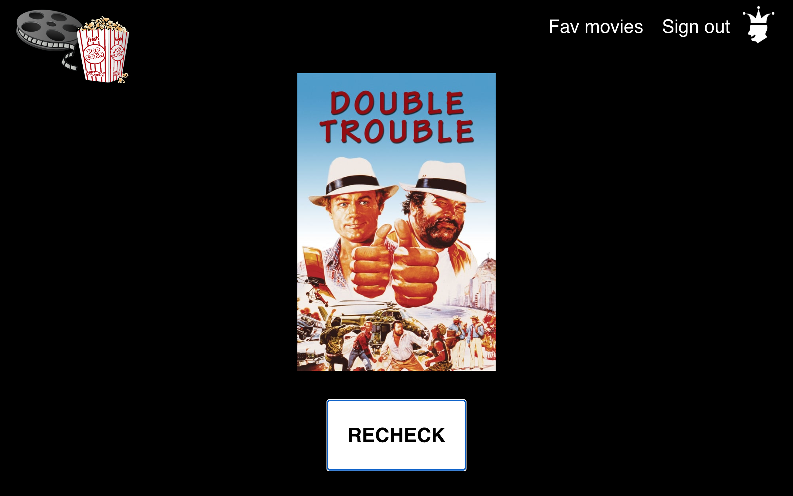
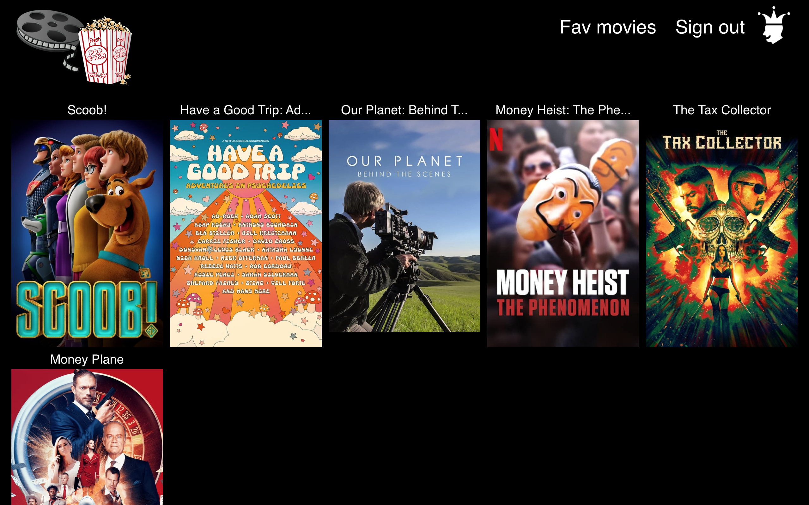

Movie App
=========

In this app I used The Movie Database API, images from Unsplash, react and redux for front-end, node.js for server-side, PostgreSQL for database and bootstrap components. 

Features:
* registration/ sign in- all information are send / fetched from the database

* on the main website after clicking on one of the genres - it’s going to next page and display movie posters with title and some descriptions, after hovering on the picture it's showing some details and also a heart that after clicking is adding this movie to favorites; there is infinity scroll technique add on this page

* on the main page, there is also a carousel that informs the client about features; after clicking on add to Fav / check joker it is sending to the proper page

* in the nav, there is the logo - which after click sending user to the main page

* nav - depends if the user is logged in or not, shows links to log in/ registration/ sign out

* joker logo- after clicking user is sent to a page on which random movie poster is displayed

* after clicking Fav on the navbar, user is sent to a page that lists all liked movies (which are stored in database)

To log in with a demo user:
login: `a@gmail.com`
password: `a`
